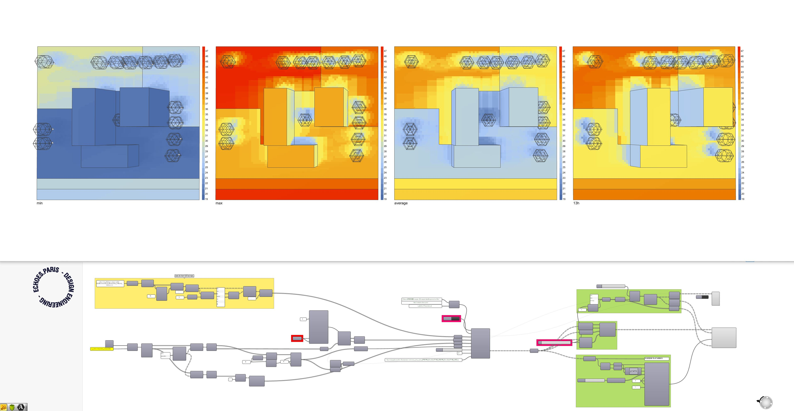

# ICEtool-gh

Transposition of [ICEtool](https://github.com/Art-Ev/ICEtool) into a Grasshopper [Hops](https://github.com/mcneel/compute.rhino3d/tree/master/src/ghhops-server-py) python server for fast calculation of surface temperatures

We combined the initial 5-steps ICETool for QGIS workflow into a single function that you can deploy remotely with Flask. 

ICETool-gh provides a simplified component that allows to make informed design choices (e.g. vegetation, materials) that take into account Urban Heat Island (UHI) phenomena.


<p align="center">

</p>
<p align="center">

</p>


### Install

With venv, pip, etc. like any other Python dev environment

```shell
    pip install requirements.txt
```


### GH Libraries

* LadybugTools
* Human 
* Wombat
* ...


### Run

```shell
    python app.py
```


### Example files

* `ee_surface temperature_example_material database.gh`
*  `ee_surface temperature_example.3dm` + `ee_surface temperature_example.gh`


### Deploy

The code is already set-up to work with Heroku. Follow [this tutorial](https://www.youtube.com/watch?v=SiCAIRc0pEI). 


### About

Ground temperature is an estimation based on :

<p align="center">

</p>


with:
- $Q_R$ : Heat flux related to radiation (from the sun, infrared radiation and the atmosphere)
- $Q_H$ : Heat flux related to convection (considered as very low and homogeneous)
- $Q_L$ : Sensitive and latent heat flux of water
- $Q_C$ : Heat flow related to conduction
- ${\delta}Q_S$ : Heat flow related to thermal storage (thermal capacity of materials)

More here : [ICEtool](https://github.com/Art-Ev/ICEtool)
